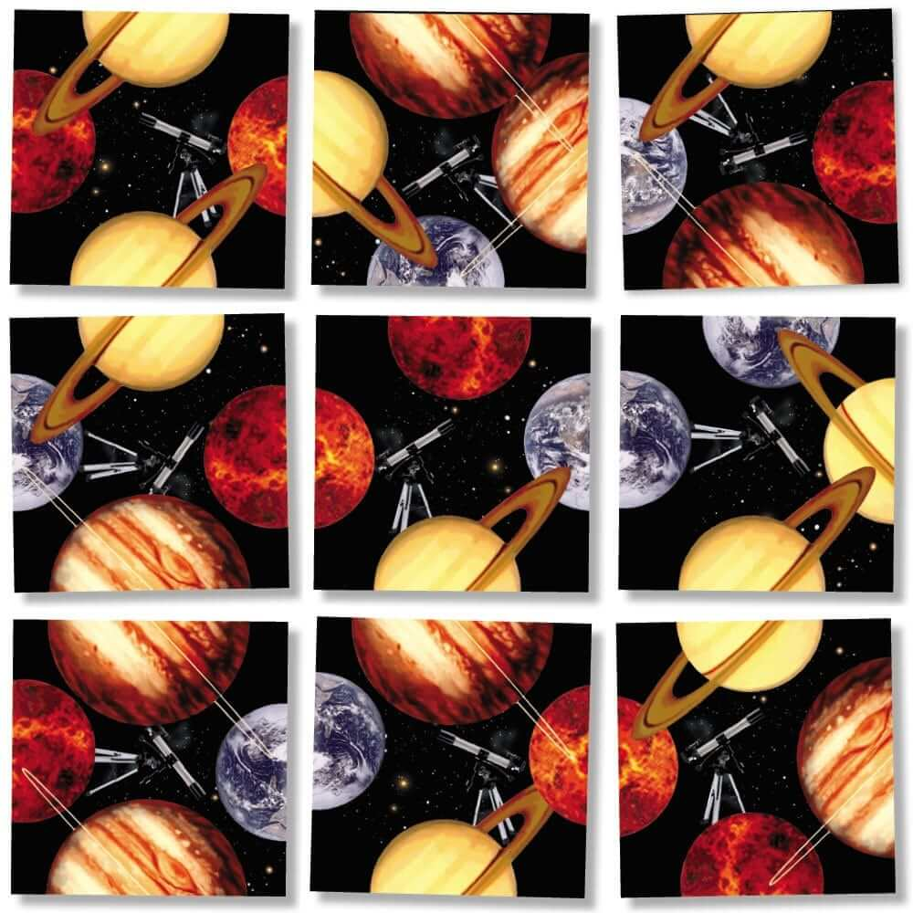

# square_rotator

## Problem Description

This project attempts to solve the popular 3x3 square puzzle game.

The objective of this puzzle is to place and rotate 9 individual "tile"s within a 3x3 grid such that each edge shared by two tiles in the grid are "aligned" with respect to each other. To aid in visualizing this puzzle we have included an image file (`puzzle.jpg`) in the root of this repository.

Each tile is a square where on each edge is contained half of a picture (we'll call this a demi-picture). The demi-picture on a given edge has no relationship to any other edge on that tile; that is, that same demi-image may appear on another edge or on no other edge on that tile at all.

The goal is to place each tile in the 3x3 grid in some orientation that ensures that all of the paired edges between tiles match. Considering the attached puzzle, many of the edges have already been paired. The top left tile and its southern neighbor form a matching pair. Likewise, the bottom left tile and its northern neighbor form a matching pair. But, note that either (or both) the upper left tile and its eastern neighbor are improperly positioned and oriented such that their edges don't form a matching pair. Its unclear which (if either or both tiles) changes need to be repositioned - placed in a different spot on the 3x3 grid - and/or reoriented - rotated in place. Discounting rotations of the entire puzzle and repeated demi-images , there are something like 4!9! (~8 million) possible combinations of tile placements and their individual orientations.

There may be more than one solution. The goal is simply to find one, and to do it in a reasonable amount of time. I have it on good account that a dullard sitting at a table trying to solve this puzzle might waste oh, I don't know, as much as 20 hours trying to solve this by hand. A computer should be able to do this much faster.
